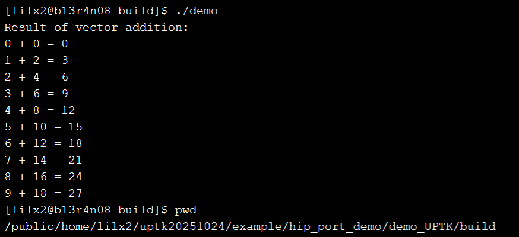

# HIP程序移植到UPTK指南

## 简介

本示例演示如何将HIP程序通过最小修改移植到UPTK框架。`hip_port_demo`目录包含两个项目：

- `demo_HIP`：原始HIP程序
- `demo_UPTK`：移植后的UPTK程序

## 移植步骤

### 代码修改

#### API替换

- 将所有HIP运行时API替换为对应的UPTK API
  - 例如：`hipDeviceSynchronize()` → `UPTKDeviceSynchronize()`

#### 头文件添加

- 在程序中引入UPTK头文件`#include <UPTK_runtime_api.h>`

  - 在源文件中引入UPTK头文件时，需遵循特定的包含顺序：

  ```
  #include <hip/hip_runtime.h>  // 首先包含HIP头文件
  #include <UPTK_runtime_api.h>  // 然后包含UPTK头文件
  ```

#### CMakeLists.txt修改

- 链接UPTK运行时库

**修改前：**

```
target_link_libraries(demo hip::host)
```

**修改后：**

```
target_link_libraries(demo hip::host UPTKrt)
```

## 编译运行指南

### demo_HIP (原始HIP版本)

```
# 前提：加载dtk环境变量
source dtk/env.sh

cd uptk/example_port/hip_port_demo/demo_HIP
mkdir build && cd build
cmake ..
make
./demo
```

**预期输出：**


### demo_UPTK (移植后的UPTK版本)

```
# 前提：加载dtk环境变量
source dtk/env.sh
# 前提：加载UPTK环境变量
source uptk/output/env.sh

cd uptk/example_port/hip_port_demo/demo_UPTK
mkdir build && cd build
cmake ..
make
./demo
```

**预期输出：**



## 环境要求

- dtk开发环境

- UPTK开发环境

- CMake 3.8+

  


